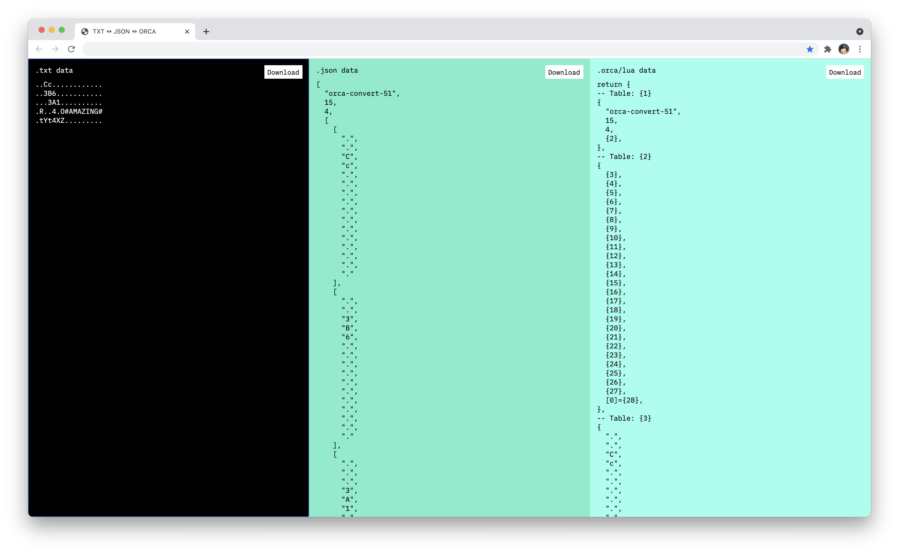

# .TXT ↔️ .JSON ↔️ .ORCA

### Converts ORCA .txt routines for use as .orca with [Norns ORCA](https://github.com/itsyourbedtime/orca).

---



This online coverter is intended to convert `.txt` ORCA routines such as those on [Patchstorage](https://patchstorage.com/platform/orca/) (or even copying from other ORCA's such as the [web version](https://hundredrabbits.github.io/Orca/)) into different formats.

The primary use case is for uploading `.orca` files for use with [Norns ORCA](https://github.com/itsyourbedtime/orca).

Cut and paste the following into the online coverter to see how it works.

```
..Cc............
..3B6...........
...3A1..........
.R..4.O#AMAZING#
.tYt4XZ.........
```

### Norns

Here's how you could upload a file via sftp — such as an exported `.orca` file — to Norns (replace <filename> with name of your file).

```bash
$ sftp we@norns.local
$ put ./<filename>.orca /home/we/dust/data/orca/<filename>.orca
```


### Development

| Command | Description |
|-|-|
| `$ npm run dev`   | Spin up ESBuild watch task and development server ([0.0.0.0:8080](http://0.0.0.0:8080)) |
| `$ npm run build` | Compile (and uglify) necessary files into `build` |

